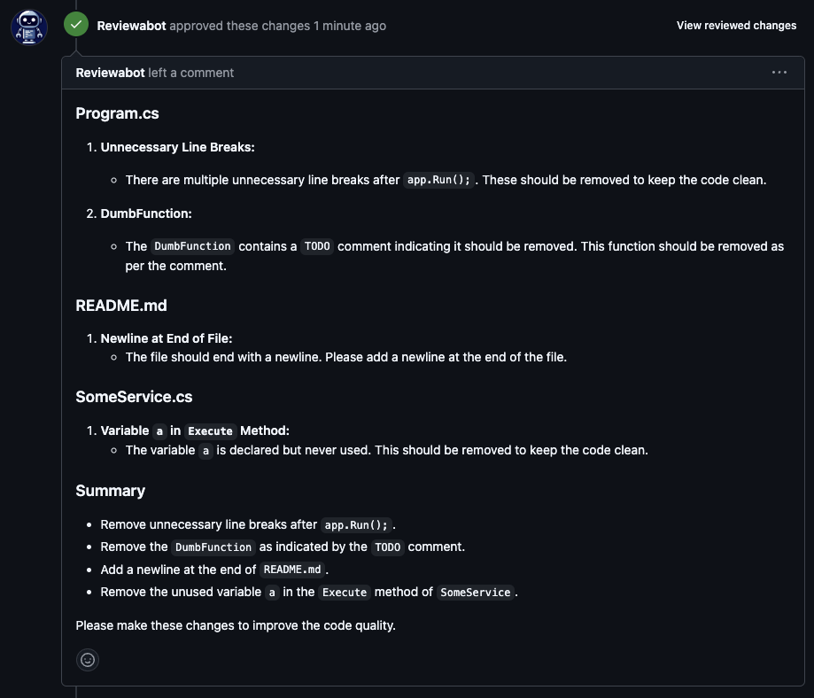

# Reviewabot Action

Reviewabot automates the process of creating a pull request review. It uses generative AI to create a review based on your instructions.

[Read more aboiut Reviewabot in this article on medium](https://medium.com/@simon.c.kofod/reviewabot-your-ai-pull-request-reviewer-cd11b46aeca2)

Here is an example of a generated PR Review.



## Requirements
### OpenAI API Key
The current version of Reviewabot requires an OpenAI API key to generate reviews. You can create an API key by visiting the [OpenAI website](https://platform.openai.com/account/api-keys).

___Place the API Key in a repository secret named `OPENAPI_KEY`.___

### GitHub Personal Access Token
A review must be created by a GitHub user, so you will need a GitHub Personal Access Token (PAT) with permission to read source and write reviews from a GitHub User Account that has been added as a contributor to the repository.

Since you cannot review your own code, I suggest that you create a new GitHub user account for the reviewer.

___Place the PAT of the reviewer in a repository secret named `REVIEWER_GITHUB_PAT`.___

## Inputs

| Input Name       | Description                                                                          | Required | Default                             |
|------------------|--------------------------------------------------------------------------------------|----------|-------------------------------------|
| `open-api-key`   | Your OpenAPI Key                                                                     | true     |                                     |
| `reviewer-pat`   | The reviewer's Private Access Token with permission to read source and write reviews | true     |                                     |
| `owner`          | Name of the owner of the repository under review                                     | false    | `${{github.repository_owner}}`      |
| `repository`     | Name of the repository under review                                                  | false    | `${{github.event.repository.name}}` |
| `pr-number`      | The pull request number                                                              | false    | `${{github.event.number}}`          |

## Example Usage

Here is an example that will trigger a review every time a pull request is opened.

```yaml
name: Review Pull Request
on:
  pull_request:
    types: [opened]

jobs:
  review:
    runs-on: ubuntu-latest
    steps:
    - name: Run Reviewabot
      uses: Reviewabot/action@v2.0.0
      with:
        open-api-key: ${{ secrets.OPENAPI_KEY }}
        reviewer-pat: ${{ secrets.REVIEWER_GITHUB_PAT }}
```

Here is an example that will trigger a review every time a given reviewer is assigned.

IMPORTANT: Insert the name of your reviewer in the action at the line containing the condition.

```yaml
name: Review Pull Request

on:
  pull_request_target:
    types: [review_requested]
    
jobs:
  review:
    if: ${{ github.event.requested_reviewer.login == '[THE NAME OF YOUR REVIEWER]' }}
    runs-on: ubuntu-latest 
    steps:
    - name: Run Reviewabot
      uses: Reviewabot/action@v2.0.0
      with:
        open-api-key: ${{ secrets.OPENAPI_KEY }}
        reviewer-pat: ${{ secrets.REVIEWER_GITHUB_PAT }}
```

Here is an example where the owner, repository, and pull request number are specified. The review runs every time a PR is opened.

```yaml
name: Review Pull Request

on:
  pull_request:
    types: [opened]
    
jobs:
  review:
    runs-on: ubuntu-latest 
    steps:
    - name: Run Reviewabot
      uses: Reviewabot/action@v2.0.0
      with:
        open-api-key: ${{ secrets.OPENAPI_KEY }}
        reviewer-pat: ${{ secrets.REVIEWER_GITHUB_PAT }}
        owner: 'my-username'
        repository: 'my-repo'
        pr-number: '1'
```
